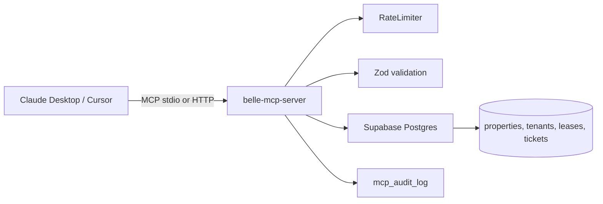

# belle-mcp-server

A reference **Model Context Protocol (MCP)** server that exposes real Belle Realty property-management data — properties, tenants, leases, maintenance tickets, rent roll — as tools that Claude Desktop, Cursor, or any MCP-compatible client can call directly.

Six tools. Five are strictly read-only. One is a HITL-gated propose-write. That ratio is intentional and is the whole point of this repo.

Part of the [AI Fluency Program — Level 2](https://github.com/OrangeOnyx/ai-fluency-program).

---

## Why this exists

Most "AI + your data" demos give the model unrestricted database access. That is a footgun.

The Model Context Protocol is designed to expose a small, curated surface area with per-tool auth, rate limits, and audit — the same discipline you'd apply to a public REST API. This repo shows what that looks like for a real domain (a Louisiana shopping center) with a real Postgres schema, a working seed, and a single HITL-gated write path.

If you understand this repo, you can build one for any business you run.

---

## What you get

| Tool | What it does | Write? |
|------|--------------|--------|
| `list_properties` | Filter portfolio by type/city. | no |
| `list_tenants` | List tenants, optionally scoped to one property. | no |
| `get_lease` | Fetch a lease by lease_id/suite_id/tenant_id. | no |
| `search_maintenance_tickets` | Multi-filter search across tickets. | no |
| `get_rent_roll` | Compute a full rent roll snapshot for a property. | no |
| `draft_maintenance_response` | Save a proposed tenant reply as a DRAFT (approved=false). | **HITL-gated write** |

Every call is rate-limited (60/min default) and audit-logged to `mcp_audit_log`.

---

## Quick start

```bash
# 1. Clone + install
git clone https://github.com/OrangeOnyx/belle-mcp-server.git
cd belle-mcp-server
npm install

# 2. Configure
cp .env.example .env
# Paste your Supabase URL + service-role key

# 3. Set up the schema (Supabase project)
#    Copy supabase/migrations/0001_init.sql into the SQL editor and run.

# 4. Seed demo data
npm run db:seed

# 5. Build + inspect
npm run build
npm run inspect
```

The MCP Inspector opens a UI where you can list tools, call them, and see raw responses.

---

## Wire it into Claude Desktop

Add to `~/Library/Application Support/Claude/claude_desktop_config.json` (macOS) or the equivalent on Windows/Linux:

```json
{
  "mcpServers": {
    "belle-realty": {
      "command": "node",
      "args": ["/absolute/path/to/belle-mcp-server/dist/index.js"],
      "env": {
        "SUPABASE_URL": "https://your-project.supabase.co",
        "SUPABASE_SERVICE_ROLE_KEY": "your-service-role-key"
      }
    }
  }
}
```

Restart Claude Desktop. You'll now see a `belle-realty` toolset. Try:

> "What suites are currently occupied at On The Boulevard, and how much monthly rent are they producing?"

Claude will call `get_rent_roll` and answer from the returned data.

---

## The HITL write pattern

The one write tool (`draft_maintenance_response`) illustrates a general pattern you should copy for any AI-facing service:

1. AI proposes a change — here, a reply to a tenant maintenance ticket.
2. The server saves it as `approved=false`.
3. Nothing is delivered, sent, or applied until a human approves it out-of-band (typically in the property manager's admin UI).
4. The MCP surface **intentionally does not expose an approve tool**. Approval is a human-only operation.

This means an over-eager or prompt-injected agent cannot silently push text to a tenant. It can propose, and it can propose loudly. It cannot ship.

For a longer walkthrough, see [`docs/hitl-pattern.md`](docs/hitl-pattern.md).

---

## Personal-use walkthrough

You're an individual landlord with 3 rental houses or one small commercial building.

1. Run the migration on your Supabase project.
2. Seed with your own data (edit `supabase/seed.ts`, or insert rows manually).
3. Point Claude Desktop at the server.
4. Ask questions like "which tenant has a lease expiring in the next 90 days?" or "draft a response to the ticket about the water heater."

You've now built an AI-native tenant operations layer that speaks your data. It cost you an evening.

---

## Company-use walkthrough

You run Belle Realty (or an equivalent management company). Multiple staff need Claude access to portfolio data without seeing raw SQL, and without any risk of accidental writes.

1. Deploy this server as a persistent process (Railway, Fly, or a Docker host).
2. Set `MCP_TRANSPORT=http` and `MCP_HTTP_TOKEN=<shared-secret>`.
3. Each teammate configures Claude Desktop or Cursor with the URL + token.
4. Read-only tools give everyone leverage. The single write tool protects the tenant relationship.
5. `mcp_audit_log` gives you an after-the-fact record of every AI action.

---

## Architecture



Details in [`docs/architecture.md`](docs/architecture.md).

---

## Extending it

Add a new tool in 4 steps:

1. Add a Zod schema for input in `src/schemas/domain.ts` (if the data shape is new).
2. Create `src/tools/<name>.ts` with an `input` schema, a handler, and a JSON-Schema definition.
3. Register it in `src/tools/index.ts`.
4. Add tests in `tests/`.

Every write tool should follow the propose-write pattern in `draft_maintenance_response`.

---

## Deploy

### Railway (recommended for HTTP transport)

```bash
railway up
```

`railway.json` builds the server and runs `node dist/index.js`. Set env vars in the Railway dashboard.

### Local (stdio only)

Just build and point your MCP client at `dist/index.js`. No hosting needed.

---

## Development

```bash
npm run dev       # tsx watch mode
npm run test      # vitest
npm run build     # tsc → dist/
npm run inspect   # MCP Inspector UI
```

---

## Related repos

- [`lease-abstractor`](https://github.com/OrangeOnyx/lease-abstractor) — extract a structured abstraction from a lease PDF/DOCX
- [`support-triage-agent`](https://github.com/OrangeOnyx/support-triage-agent) — same HITL pattern applied to support messages
- [`diligence-agent`](https://github.com/OrangeOnyx/diligence-agent) — RAG-based diligence over a document folder
- [`ai-fluency-program`](https://github.com/OrangeOnyx/ai-fluency-program) — parent curriculum

---

## License

MIT — see [LICENSE](LICENSE).

Not legal, tax, or property-management advice. Do not use for compliance-critical decisions without a licensed professional in the loop.
