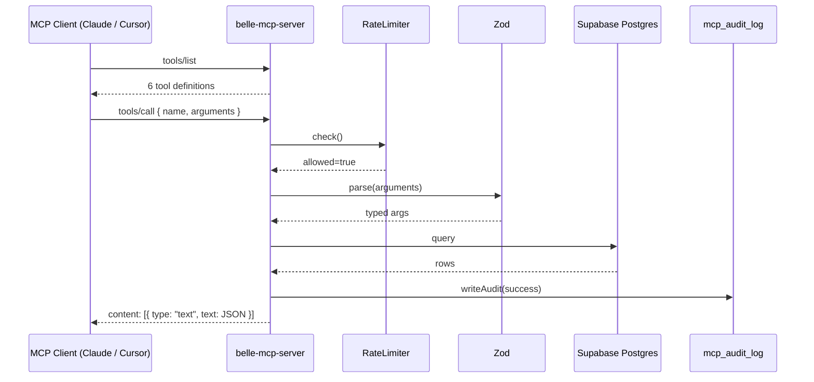

# Architecture

## Request flow

## Layers

- **Transport** — `@modelcontextprotocol/sdk` stdio server (default) or HTTP.
- **Request handlers** — one for `tools/list`, one for `tools/call`.
- **Rate limiter** — sliding-window, in-memory. Swap for Redis if you scale to multiple nodes.
- **Validation** — Zod on every tool input. Malformed args fail fast with a helpful error.
- **Data access** — Supabase JS client using the service-role key. No client-side exposure.
- **Audit** — best-effort insert into `mcp_audit_log`. Failure to audit never breaks a tool call.

## The write path

`draft_maintenance_response` is the only tool that writes. It:

1. Verifies the ticket exists.
2. Inserts a row into `draft_responses` with `approved=false`, `approved_by=null`, `approved_at=null`.
3. Returns the draft plus a `hitl_notice` string telling the caller nothing will be delivered until a human approves it.

There is no `approve_draft` MCP tool by design. Approvals happen in the property manager's admin UI or a separate backend service — an intentional trust boundary.

## Schema

See [`../supabase/migrations/0001_init.sql`](../supabase/migrations/0001_init.sql).

Core tables: `properties`, `suites`, `tenants`, `leases`, `maintenance_tickets`, `draft_responses`, `mcp_audit_log`.

The rent-roll tool joins `suites → leases → tenants` in one query and computes derived fields (`total_monthly`, `months_until_expiration`, `occupancy_pct`) in the server rather than the DB. Both places would be defensible.
